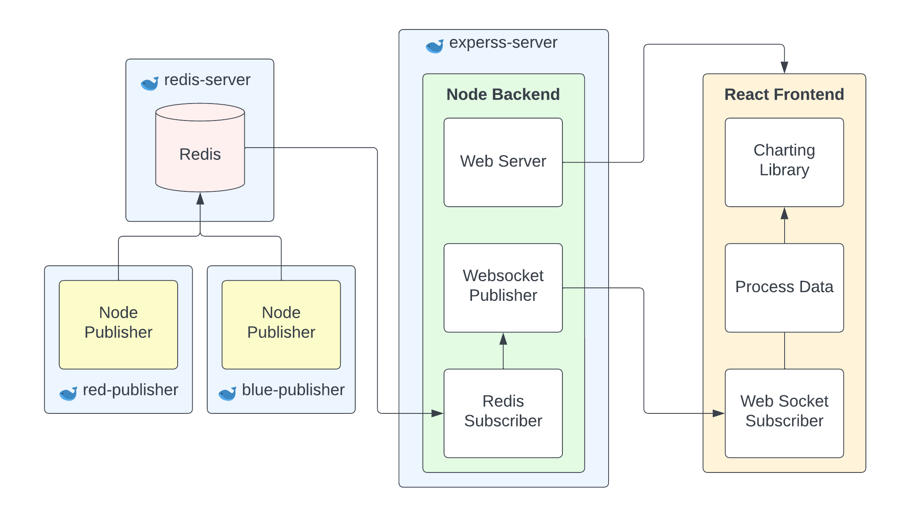

# Random Walk

This project is an interview take home project. The prompt was:

> Build a real-time data visualization dashboard for data streaming from a source of your choice.

# Data source

I was not able to find a streaming data service that I liked so I decided to build my own.
After going through a few ideas I settled on building a stream for a random walk

## What is a random walk?
A [Random Walk](https://en.wikipedia.org/wiki/Random_walk) is where you start at the origin (0,0) and then take one random step in one
of the four cardinal directions and repeat. 

## Why pick random walk as a data source?

- No state that has to be merged
  - My second favorite idea was to simulate a race, but then you'd need to serve an initial state of where all the racers are and then merge in the streaming updates. That would be cool, but would take more time to implement.
- Random walks produce mildly interesting patterns to visualize
- Will have a very simple data stream

# Architecture

## Reasoning

- Backend in Node
  - Node has nice async support. So having to listen to a subscription and publish to a websocket will be pretty easy.
- Frontend in react
  - It is what I'm most familiar with and I've used recharts before.
- Redis used for pub/sub
  - This is certainly overkill for this small project, but seeing how I'm not actually connecting to an API I thought this would show the work that would be needed to be done in that case.
- Two node processes publish events
  - Just for fun. This is to simulate having multiple streams of data coming in and displaying both of those on one page
- Why have the client process data?
  - For fun. More interesting then having the frontend just display what the backend sends it. I think in a real application you would do as much processing as you could on the backend but the frontend will still need to do some.

# Project plan

- [x] Plan architecture
- [x] Connect node to redis pub/sub
- [x] Create node websocket endpoint that publishes events from redis
- [x] Serve react page via express
- [x] Connect react page to websocket
- [x] Generate data on node server to publish to redis
- [x] Create graphs to display the walk
- [x] Style frontend
- [x] Dockerize/deploy 

# What would I change if I were to spend more time on this project
- Clean up App.tsx
  - A bit messy with types and data helpers. Would be nicer if those were split out, but it is a small enough amount of code that I think it is fine where it is
- Handle `any` types

# Questions

## How you would handle large number of clients

We could do a couple of things to increase the number of clients.
- Serve multiple websockets from one redis connection
    - Rather than having one redis connection for each websocket, have each node process share a connection. I think this could be done with PubSubJS where each node process will only need one connection but we can serve multiple websockets with one node process. (perhaps I am misunderstanding how node processes work though)
- Use a redis-cluster to increase number of available redis connections
- Horizontally scale our node-backend to increase the number of websocket connections

## How you would handle large volumes of data

There are a few strategies to help manage large amounts of data
- Only send data that is needed for the frontend
  - Process the raw data on the backend so that what is being sent to the frontend is only what is needed
  - Maybe it is a large page with lots of graphs that are not in the view port. Don't subscribe to their data until we need to render them.
- Use a dense message format
  - Could send bits rather than json strings
- Optimize for small updates
  - If we need to send a lot of data to our frontend, it would make sense to optimize for small updates. So maybe sending the whole state every tick would be easiest, but that is a lot of data. So we're better off sending a small update and then having more complicated logic on the frontend to handle that
- Batch messages
  - Still the same amount of work, but maybe by batching we can avoid some overhead?
    - I'm not sure how much overhead there is for receiving something over a websocket?

## How you would ensure that the dashboard remains responsive and performant

I've never had to deal with high performance issues on the frontend so this is mostly a guess:

- Minimize the amount that has to be re-rendered
  - I think this would depend on the charting library used, but have a good understanding of how that process works would be important
- Limit data being shown
  - Probably can't see the difference between 100k points and 1M points on a scatter chart. Use data roll-ups to keep the amount of data we're dealing with reasonable. 
- Have frontend data processing done in webassembly so it will be faster
- "Don't block the main thread"
  - Use webworkers to handle as many calculations as possible (especially if the frontend is doing non-trivial data processing)
